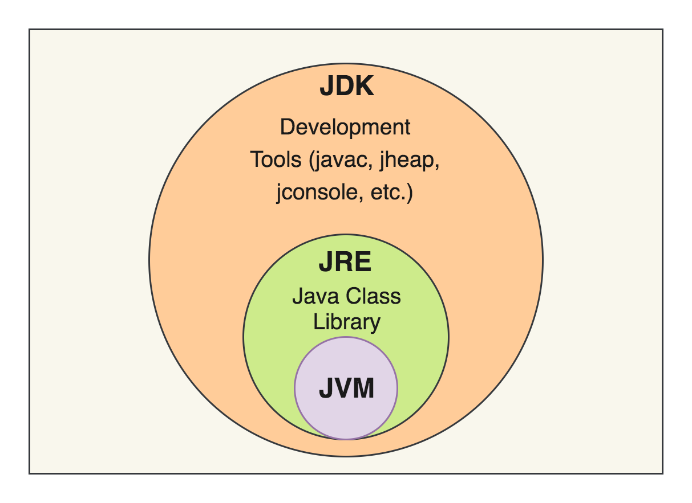

# 자바를 공부하기 전에 알아두면 좋은 것들 1

## JDK
- Java Development Kit
- JRE + 개발 도구
- 컴파일러, 디버그 도구 포함
- JDK를 설치하면 JRE, JVM이 모두 설치된다. 
- Java 버전 = JDK 버전

## JRE
- Java Runtime Environment
- JVM + 자바 프로그램, 실행에 필요한 라이브러리 등
- JVM 실행환경

## JVM
- Java Virtual Machine
- OS별로 존재한다. 
- 바이너리 코드를 읽고 검증하고 실행한다. 