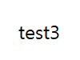
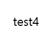

본 마크다운은 헤로피 님의 **Markdown 사용법 총정리**(출처: https://heropy.blog/2017/09/30/markdown/)를 그대로 따라 작성했습니다.<br>
<br>

# 마크다운 문법(Syntax)


## 제목(Header)

`<h1>`부터 `<h6>`까지 제목을 표현할 수 있습니다. 

    # 제목1
    ## 제목2
    ### 제목3
    #### 제목4
    ##### 제목5
    ###### 제목6

제목1(h1)과 제목2(h2)는 다음과 같이 표현할 수 있습니다.

    제목1
    =====

    제목2
    -----

<br><br><br>

## 강조(Emphasis)
---
<br>

각각 `<em>`, `<storng>`, `<del>` 태그로 변환됩니다. 

밑줄을 입력하고 싶다면 `<u></u>` 태그를 사용하세요. 

    이탤릭체는 *별표(asterisk)* 혹은 _언더바(underscore)_를 사용하세요.
    두껍게는 **별표(asterisk)** 혹은 __언더바(underscore)__를 사용하세요. 
    **_이탤릭체_와 두껍게**를 같이 사용할 수 있습니다.
    취소선은 ~~물결표시(tilde)~~를 사용하세요.
    <u>밑줄</u>은 `<u></u>`를 사용하세요. 

이탤릭체는 *별표(asterisk)* 혹은 _언더바(underscore)_를 사용하세요.
두껍게는 **별표(asterisk)** 혹은 __언더바(underscore)__를 사용하세요. 
**_이탤릭체_와 두껍게**를 같이 사용할 수 있습니다.
***이탤릭체*와 두껍게**를 같이 사용할 수 있습니다.
취소선은 ~~물결표시(tilde)~~를 사용하세요.
<u>밑줄</u>은 `<u></u>`를 사용하세요. 

(작성자: VSCode Markdown All In One extension을 사용한 환경에서는 언더바를 이용한 강조 표현이 올바르게 작동하지 않는 것으로 보인다.)

<br><br><br>

## 목록(List)
---
<br>

`<ol>`, `<ul>` 목록 태그로 변환됩니다.

    1. 순서가 필요한 목록
    2. 순서가 필요한 목록
       - 순서가 필요하지 않은 목록
       - 순서가 필요하지 않은 목록
    3. 순서가 필요한 목록
       1. 순서가 필요한 목록
       2. 순서가 필요한 목록
    4. 순서가 필요한 목록

    - 순서가 필요하지 않은 목록에 사용 가능한 기호
      - 대쉬(hyphen)
      * 별표(asterisk)
      + 더하기(plus sign)

1. 순서가 필요한 목록
2. 순서가 필요한 목록
   - 순서가 필요하지 않은 목록
   - 순서가 필요하지 않은 목록
3. 순서가 필요한 목록
   1. 순서가 필요한 목록
   2. 순서가 필요한 목록
4. 순서가 필요한 목록

- 순서가 필요하지 않은 목록에 사용 가능한 기호
  - 대쉬(hyphen)
  * 별표(asterisk)
  + 더하기(plus sign)

<br><br><br>

## 링크(Links)
---
<br>

`<a>`로 변환됩니다.

    [GOOGLE] (https://google.com)

    [NAVER] (https://naver.com "링크 설명(title)을 작성하세요.")

    [상대적 참조] (../users/login)

    [Dribble] [Dribble Link]

    [Github] [1]

    문서 안에서 [참조 링크]를 그대로 사용할 수도 있습니다.

    다음과 같이 문서 내 일반 URL이나 꺽쇠 괄호(`< >`, Angle Brackets) 안의 URL은 자동으로 링크를 사용합니다. 
    구글 : https://google.com
    네이버 : <https://naver.com>

    [Dribble Link]: https://dribble.com
    [1]: https://github.com
    [참조 링크]: https://naver.com "네이버로 이동합니다."

[GOOGLE](https://google.com)

[NAVER](https://naver.com "링크 설명(title)을 작성하세요.")

[상대적 참조](../users/login)

[Dribble][Dribble Link]

[Github][1]

문서 안에서 [참조 링크]를 그대로 사용할 수도 있습니다.

다음과 같이 문서 내 일반 URL이나 꺽쇠 괄호(`< >`, Angle Brackets) 안의 URL은 자동으로 링크를 사용합니다. 

구글 : https://google.com

네이버 : <https://naver.com>

[Dribble Link]: https://dribble.com

[1]: https://github.com

[참조 링크]: https://naver.com "네이버로 이동합니다."

(작성자: 띄어쓰기가 굉장히 중요하다.)

<br><br><br>

## 이미지(Images)
---
<br>

``로 변환됩니다. 

링크와 비슷하지만 앞에 `!`가 붙습니다. 

    

    ![test4][image]

    [image]: image/test4.png "Test4"


![test4][image]

[image]: image/test4.png "Test4"

<br>

### 이미지에 링크
---
<br>

마크다운 이미지 코드를 링크 코드로 묶어 줍니다.

    []

[](https://kr.vuejs.org/)

<br><br><br>

## 코드(Code) 강조
---
<br>

`<pre>`, `<code>`로 변환됩니다. 
숫자 1번 키 왼쪽에 있는 ` (grave)를 입력하세요.

<br>

### 인라인(inline) 코드 강조
---
<br>

    `background` 혹은 `backgroud-image` 속성으로 요소에 배경 이미지를 삽입할 수 있습니다. 

`background` 혹은 `backgroud-image` 속성으로 요소에 배경 이미지를 삽입할 수 있습니다. 

<br>

### 블록(block) 코드 강조
---
<br>

` 를 세 번 이상 입력하고 코드 종류도 적습니다. 

    ```html
    <a href="https://www.google.co.kr/" target="_blank">Google</a>
    ```

    ```css
    .list > li {
        position: absolute;
        top : 40px;
    }
    ```

    ```javascript
    function func() {
        var a = 'AAA';
        return a;
    }
    ```

    ```bash
    $ vim ./~zshrc
    ```

    ```python
    s = "python syntax highlighting"
    print s
    ```

    ```
    No language indicated, so no syntax highlighting.
    But let's throw in a tag.
    ```

```html
<a href="https://www.google.co.kr/" target="_blank">Google</a>
```

```css
.list > li {
    position: absolute;
    top : 40px;
}
```

```javascript
function func() {
    var a = 'AAA';
    return a;
}
```

```bash
$ vim ./~zshrc
```

```python
s = "python syntax highlighting"
print s
```

```
No language indicated, so no syntax highlighting.
But let's throw in a tag.
```

(작성자: 띄어쓰기 네 번 또는 탭 한 번 들여쓰기 후 작성한 내용 또한 블럭 코드 강조 기능으로 동작한다. 들여쓰기가 되지 않은 텍스트를 만나면 멈춘다. )

<br><br><br>

## 표(Table)
---
<br>

`<table>`태그로 변환됩니다.

헤더 셀을 구분할 때 3개 이상의 `-` 기호가 필요합니다.

헤더 셀을 구분하면서 `:` 기호로 셀 안에 내용을 정렬할 수 있습니다.

가장 좌측과 가장 우측에 있는 |(vertical bar) 기호는 생략 가능합니다.

    | 값 | 의미 | 기본값 |
    |---|:---:|---:|
    | `static` | 유형(기준) 없음 / 배치 불가능 | `static` |
    | `relative` | 요소 **자신**을 기준으로 배치 |  |
    `absolute` | 위치 상 ***부모(조상)요소***를 기준으로 배치 |
    `fixed` | 브라우저 창을 기준으로 배치 |  

| 값 | 의미 | 기본값 |
|---|:---:|---:|
| `static` | 유형(기준) 없음 / 배치 불가능 | `static` |
| `relative` | 요소 **자신**을 기준으로 배치 |  |
`absolute` | 위치 상 ***부모(조상)요소***를 기준으로 배치 |
`fixed` | 브라우저 창을 기준으로 배치 |  

<br><br><br>

## 인용문(BlockQuote)
---
<br>

`<blockquote>` 태그로 변환됩니다.

    인용문(blockQuote)

    > 남의 말이나 글에서 직접 또는 간접으로 따온 문장.
    > _(네이버 국어 사전)_

    BREAK!

    > 인용문
    >> 중첩된 인용문
    >>> 중중첩된 인용문 1
    >>> 중중첩된 인용문 2
    >>> 중중첩된 인용문 3

인용문(blockQuote)

> 남의 말이나 글에서 직접 또는 간접으로 따온 문장.
> _(네이버 국어 사전)_

BREAK!

> 인용문
>> 중첩된 인용문
>>> 중중첩된 인용문 1
>>>> 중중첩된 인용문 2
>>>>> 중중첩된 인용문 3

<br><br><br>

## 원시 HTML(Raw HTML)
---
<br>

마크다운 문법이 아닌 원시 HTML 문법을 사용할 수 있습니다.

    <u>마크다운에서 지원하지 않는 기능</u>을 사용할 때 유용하며 대부분 잘 동작합니다.

    

    

<u>마크다운에서 지원하지 않는 기능</u>을 사용할 때 유용하며 대부분 잘 동작합니다.




<br><br><br>

## 수평선(Horizontal Rule)
---
<br>

각 기호를 세 개 이상 입력하세요. 

    ---
    (hyphens)

    ***
    (asterisks)

    ___
    (underscores)

---
(hyphens)

***
(asterisks)

___
(underscores)

<br><br><br>

## 줄바꿈(Line Breaks)
---
<br>

    동해물과 백두산이 마르고 닳도록
    하느님이 보우하사 우리나라 만세  <!-- 띄어쓰기 2번 -->
    무궁화 삼천리 화려강산<br>
    대한 사람 대한으로 길이 보전하세

동해물과 백두산이 마르고 닳도록
하느님이 보우하사 우리나라 만세  <!-- 띄어쓰기 2번 -->
무궁화 삼천리 화려강산<br>
대한 사람 대한으로 길이 보전하세

(작성자: VSCode Markdown All in One을 사용하는 작성자의 환경에서는 띄어쓰기 두 번으로 줄바꿈이 되지 않는다.)